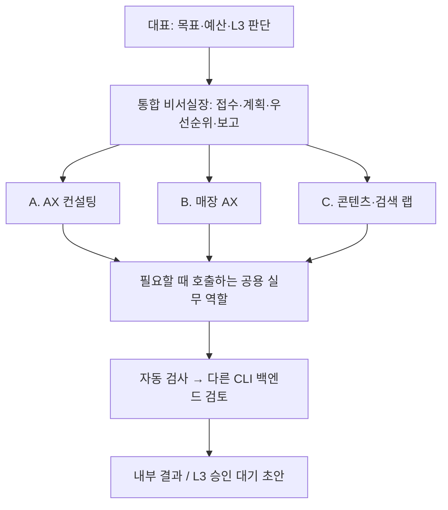

# AI Office v0.4 — 단계별 구축 계획

기준일: 2026-09-26 (Asia/Seoul). 기준: [SPEC.md](SPEC.md). **현재 Phase 0: 조사·계획만 작성. Phase 1 실행 승인 전이다.** 기존 PLAN의 미커밋 내용은 [보존본](PLAN-pre-v04-2026-09-26.md)에 그대로 남겼다.

## 목표 구조와 책임

- 사업 라인은 헌장·백로그·KPI 문서로 운영한다. 상주 에이전트 3개를 띄우는 설계가 아니다.
- 비서실장이 접수·우선순위·통합 보고를 맡고 각 실행 역할이 결과와 근거를 책임진다.
- 기존 데모 고도화 미션은 보존한다. 신규 구축 순서는 이번 SPEC의 Phase 1–5를 따른다.
- 승인, 결과물 생성, 실제 업무 성과, 독립 검증 완료를 별개로 기록한다.

## 단계와 종료 조건

| 단계 | 작업 | 수용·증거 | 종료 후 |
|---|---|---|---|
| 0 | 원문 보존, CLI·인증·모델·기존 두 시스템 조사, 구조/이관 결정 | 문서 외 변경 0, 기존 저장소 변경 0; 미확인 환경은 명시 | CP0 후 STOP |
| 1 | 조직·헌장·역할·권한, CLI doctor/run/ledger, 큐/원장, 4종 backend | fake 검증 + doctor + SDK/key 스캔 + 양 CLI OK 각 1회 기록 | CP1 후 STOP |
| 2 | intake/brief/weekly plan/approve/reject, 룰북 후보, 양 CLI 스킬 | 실제 2026-09 전사에서 R1–R11 출처 매칭; 승인 전 본 룰북 변경 없음 | CP2 후 STOP |
| 3 | quote_audit, work_order, 플래너 연동 제안서 | SPEC 10장 전체 오라클 + 11장 작업지시 조건 + 교차 검토 | CP3 후 STOP |
| 4 | 가맹점 공개 링크/정보 점검, 수동 기록 양식, GEO 기준선 | stores.csv 기반 리포트·개선 목록·초안; 금지 수집 없음 | CP4 후 STOP |
| 5 | localhost 콘솔·수기 수익원장·RUNBOOK·선택 일정 스크립트 | 실제 로컬 조회·승인 흐름 검증, 일정 설치는 별도 승인 | CP5 후 STOP |

각 단계는 `승인: Phase {n} 진행`을 받은 후에만 시작한다. 아래 내용은 구현 지시를 구체화한 계획이며 지금 실행할 명령이 아니다.

## Phase 1 — 구독 실행을 검증할 수 있는 최소 기반

1. 기존 웹/음성/DB는 유지하고 신규 `python -m office` 진입점을 추가한다. 신규 DB `data/runtime/office-v04.sqlite3`로 분리하며 기존 service를 import·생성해서 폴링을 켜지 않는다.
2. SPEC 구조에 `.agents/skills/`와 런타임 DB 위치를 보완한다. AGENTS는 150줄 이하, CLAUDE 첫 줄은 `@AGENTS.md`. 사업 라인 헌장에는 SPEC의 오퍼·90일 KPI·중단 조건을 담는다.
3. `.gitignore`에 고객·환경파일을 제외하고 단가 시드는 추적한다. 기존 data/가 실수로 노출되지 않도록 추적 목록과 ignore 동작을 검증한다.
4. 권한·고객경계·구독 인증·환경변수·모델·일일 상한을 검사한 뒤에만 subprocess를 시작한다. L3 실행 분기는 만들지 않는다. dry-run은 CLI/네트워크를 호출하지 않고 마스킹한 실행 계획을 보여 준다.
5. 표준 RunResult와 네 backend를 구현한다. API stub은 기본 꺼짐이며 사내 scope는 거절한다. SDK는 필요하지 않으므로 기본 구현에서는 import하지 않는다.
6. 큐 상태는 pending/running/completed/failed/deferred/awaiting_approval 등 책임을 분리한다. 실패·쿼터를 자동 재실행하지 않는다. 원장은 역할·백엔드·모델·목적·시작/종료·종료코드·deferred를 저장하고 원문을 넣지 않는다.
7. fake 기반 테스트로 환경 정리와 부모 존재 시 차단, backend 선택, 검증자 불일치, stub 차단, quota 배치 중단, PII 마스킹, 경로 탈출·고객 격리를 검증한다. 실제 구현 없이 테스트만 통과시키는 방식은 금지한다.
8. doctor의 전체 항목이 해소되고 설치본 플래그/계정 모델을 확인한 후, 고객 데이터 없이 양 CLI에 `OK`만 답하도록 각 1회 호출한다. 총 2회이며 원장에 남긴다. 실패 시 성공했다고 적지 않고 CP1에 이유를 기록한다.

**현재 선행 문제:** Claude 명령 미발견; Codex CLI `Not logged in`; forced_login_method 미설정; 양 CLI 실제 모델 검증 미완료. CLI 설치·로그인 및 사용자 설정 변경을 이번 Phase 0의 암묵적 작업으로 처리하지 않는다. Phase 1을 승인받아도 선행 문제 해결 전 실제 호출 수용 기준을 충족했다고 보고할 수 없다.

## Phase 2 — 비서실장 워크플로

| 기능 | 설계·검증 |
|---|---|
| intake | 작업의 라인·역할·권한·기한, 결정/미결, 룰북 후보와 출처 시각. 고객 전사는 clients 안에서 처리 |
| brief | 승인 대기·임박·막힘·라인별 KPI·실행/보류. 미집계는 미집계로 표시 |
| plan --week | 각 헌장과 백로그를 주간 계획에 연결. 사업 라인 프로세스를 상시 실행하지 않음 |
| approve/reject | 승인 대상 버전·판단·시각 기록. L3 결정은 자동 발송/배포와 연결하지 않음 |
| 룰북 | 후보와 승인본 분리. 고객 식별정보가 없는 일반화 후보만 공용 SOP에 둠 |
| 스킬 | org 역할 원본을 참고하는 Claude/Codex 대화형 워크플로. 불필요한 중복 실행 금지 |

실제 전사 `clients/baekchobap/raw/transcript-2026-09.txt`는 현재 없다. 원본 도착 전에는 합성 fixture만 사용할 수 있고, 합성 데이터의 통과를 실제 전사 수용으로 보고하지 않는다. R1–R11의 타임스탬프를 추출 후보와 대조하고 R12는 도면 메모 출처로 구분한다.

## Phase 3 — 매장 AX MVP

### 3a. 견적 검증

표지·집계·내역 연결과 공종/품목/규격/단위/수량/자재·노무·경비/총액 스키마를 먼저 고정한다. xlsx는 수식과 cached 값을 함께 읽으며, cached 값이 없으면 추정해서 통과시키지 않는다. PDF는 구독 CLI 추출 뒤 코드로 산술/범위를 검증한다. 고객 원문을 CLI에 전달하는 것도 외부 전송이므로 [D21](DECISIONS.md)의 L3 경계를 먼저 적용한다. 자동 검증은 합성·비고객 자료부터 시작하고 실제 원문은 승인된 대표 대화형 처리 범위가 확정되기 전 전송하지 않는다. 금액은 원 단위와 명시적 절사 규칙을 사용한다.

| SPEC 오라클 | 필수 검증 |
|---|---|
| 명지점 집계 | 설비 150,000 차이, 합계열 9,379,045 vs 자재+인건/표지 9,229,045 |
| 명지점 범위 | 사인공사 별도 문구와 포함액 1,690,000의 모순 |
| 명지점 간접비 | 171,660 / 461,452 / 501,886, 소계 1,134,999, 합계 10,364,044 → 10,300,000 |
| 명지점 민감도 | 150,000 반영 시 10,525,083 → 10,500,000, 차이 200,000; 보험료 누락·전기 1인 일괄 |
| 평택 산술/총액 | 20,820,000 + 2,082,000 = 22,902,000; 13개 총액 항목 비율 100% |
| 평택 누락/변경 | 전기 3,800,000 내역 없음, 목작업 추가 1,800,000·목공 합계 5,940,000/28.5%, A/C 3,500,000 별도비용 불명 |
| 평택 문서관리 | TODAY(), N25–N28 직접 입력, 세액 R/T 위치 차이, 연락처/사업자정보 마스킹 |

SPEC의 기대 금액이 원자료/반올림 규칙과 다르면 결과를 억지로 맞추지 않고 차이를 드러낸다. 원본 파일을 수령한 뒤 실제 입력 수용 검증을 수행한다. 결과는 `clients/<id>/reports/quote-audit-*` 안에만 저장한다.

### 3b. 공사 코파일럿

- 조명 작업 5개·콘센트 작업 3개와 모든 메모 자재를 보존한다. `레일 46m`와 `2m×25개` 같은 입력 내 수량 차이는 미결로 남기고 조용히 보정하지 않는다.
- 목공에 주방 파티션 CD관 16mm 선매립 요청을 넣고 공종 간 의존관계를 연결한다.
- A/C 위치 미정은 발행 차단 항목이다. 알 수 없는 위치·높이·단가는 확인 필요/단가 필요로 표시한다.
- 공정은 전기 선작업→목공 골조→전기→목공 마감→전기 마감. 에어컨 배관비·스카이는 별도 범위로 분리하며 근거 없는 금액을 만들지 않는다.
- 공종별 지시서, 철거 보존/제거, BOQ·공수 근거·인원·공정, 미결, 요약/상세 견적을 낸다. 단가 n=1은 시장 대표 가격이 아니다.

### 3c. 기존 플래너 연동 제안만 작성

`docs/integration-store-planner.md`에 FloorPlan 요소 ID·mm 좌표·공종·출처를 연결하는 sidecar 계약과 전기 레이어 토글 제안을 작성한다. 기존 저장소를 수정하지 않는다. TS export용 Office 어댑터는 현재 없는 기능이며 승인·호환 검증 전에는 호출 가능하다고 보고하지 않는다.

출점 매출 범위·비율·근거·인근 가맹점 선택지는 현행 공식 법령을 검토한 뒤 설계한다. SPEC의 법령 관련 숫자를 이번 단계에서 검증한 사실처럼 쓰지 않는다. 보장 표현과 외부 자동 발행은 금지한다.

## Phase 4–5 — 점검과 운영

Phase 4는 대표가 채운 매장 CSV의 공개 링크 HTTP 상태와 표시 정보만 조사한다. 로그인 필요 정보·최근 게시일·AI 답변 표본은 수동 입력한다. 소비자 AI 화면 자동 질문·수집 기능은 만들지 않는다. 매장별/브랜드 보고와 콘텐츠 캘린더는 초안으로 저장한다.

Phase 5는 새 원장·큐를 읽는 localhost 콘솔을 만든다. 상태는 명령 후 갱신·수동 갱신 등으로 제공하며 주기적 polling은 추가하지 않는다. 08:30 일정은 선택 사항이고 설치/제거 스크립트 제공과 실제 등록을 구분한다. 사례는 익명화 초안에서 출발하며 홈페이지의 로컬 브랜치 변경도 기존 저장소 쓰기 승인 이후에만 한다. push·게시 실행 경로는 만들지 않는다.

## 검증과 보고 원칙

CP마다 SPEC 8장의 9개 항목을 지킨다. Phase 0의 doctor 미구현·원장 부재는 실제 실패/N/A로 기록한다. 테스트와 실제 모델 호출은 해당 단계에서만 수행한다. 실행·검증·성과를 구분하며 담당, 산출물, 실제 달성 여부, 소요 시간, 남은 일, 필요한 대표 결정만 먼저 보고한다.

현재 결과와 정지 지점: [CP0](checkpoints/CP0.md). 구조·판단 근거: [DECISIONS](DECISIONS.md). 명령·인증·시스템 조사: [ENVIRONMENT](ENVIRONMENT.md).
